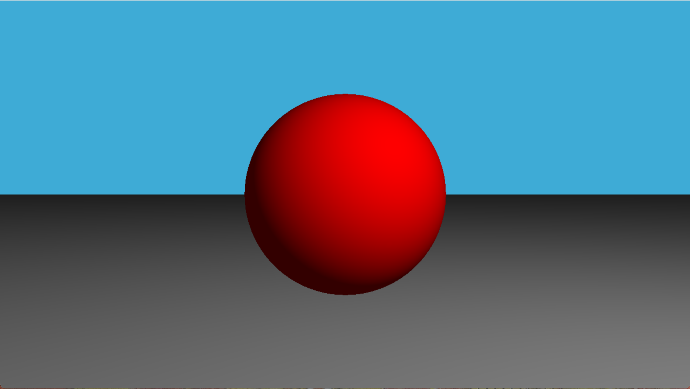
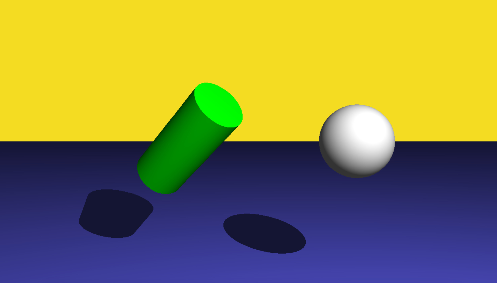
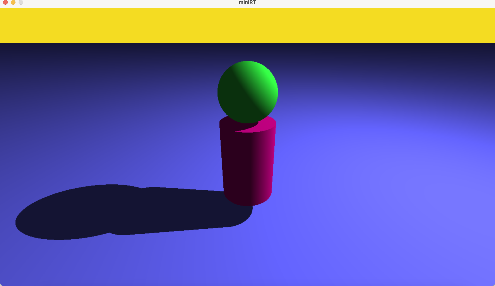

*This project has been created as part of the 42 curriculum by qizhang, kevisout.*
# miniRT: A Ray Tracing Engine in C

## Introduction
miniRT is a minimalist ray tracing engine developed from scratch in C. The project serves as an entry point into computer graphics, focusing on the core principles of light simulation, coordinate space transformations, and geometric intersection algorithms. By casting rays through a virtual viewport, the engine simulates how light interacts with mathematical primitives to render a three-dimensional scene onto a two-dimensional grid of pixels.

## Technical Implementation

### The Rendering Pipeline
The engine operates on a pixel-by-pixel rendering loop following these discrete stages:
1. **Ray Generation:** A ray is initialized with an origin at the camera's position. Its direction vector is calculated by converting the 2D pixel coordinates $(x, y)$ into 3D world space coordinates based on the camera's orientation and Field of View (FOV).
2. **Intersection Testing:** The ray is tested against all geometric primitives in the scene. The engine identifies the closest intersection point along the ray's path.
3. **Shading and Shadowing:** If an intersection occurs, the engine calculates the surface normal at that point, computes the light contribution, casts secondary rays to detect shadows, and writes the final color to the frame buffer.

### Mathematical Foundations
The engine relies on a custom 3D vector library. Key mathematical implementations include:
* **Vector Algebra:** Implementations of addition, subtraction, normalization, and scaling.
* **Geometric Products:** Dot products for angle determination and projection; cross products for establishing orthogonal camera coordinate systems.
* **Quadratic Systems:** Solving algebraic equations to find precise entry and exit points for curved surfaces.

### Geometric Primitives
The engine handles three distinct geometric shapes, each requiring a unique analytical solution for ray intersection:

* **Sphere:** Formulated using the algebraic equation of a sphere centered at an arbitrary point. Intersections are found by solving a quadratic equation for the ray parameter $t$.
* **Plane:** Formulated using a point on the plane and its surface normal vector. The intersection is a linear calculation determining where the ray pierces the infinite flat surface.
* **Cylinder:** Implemented by defining a bounded cylinder with a specific radius, axis vector, and height. The algorithm solves for the infinite lateral surface and validates if the intersection falls within the axial bounds.

## Lighting and Shading Model

The engine utilizes a deterministic shading model to simulate depth, form, and spatial relationships:

* **Ambient Illumination:** A constant light factor applied globally to all objects. This ensures that regions completely occluded from direct light sources are not rendered as pure black, simulating indirect environmental bounces.
* **Diffuse Shading (Lambertian Reflection):** Calculates how much light a surface reflects based on its orientation relative to the light source. The intensity is proportional to the dot product of the surface normal vector ($\vec{N}$) and the normalized light direction vector ($\vec{L}$):
  $$I = \vec{N} \cdot \vec{L}$$
* **Hard Shadows:** For every valid intersection point, a secondary shadow ray is cast toward the light source. If any geometry intersects this shadow ray before it reaches the light, the direct diffuse light component is omitted, casting the pixel into shadow.

## Software Architecture
* **Language:** C (C99 Standard)
* **Graphics Library:** MiniLibX (simple window and pixel-writing interface)
* **Memory Management:** Deterministic heap allocation with centralized cleanup sequences to guarantee zero memory leaks upon program termination.
* **Parser:** A strict, token-based `.rt` configuration file parser featuring validation for coordinate bounds, vector normalization status, and color ranges.

## Usage

### Compilation
Compile the executable using the provided Makefile:
```bash
make
```
### Execution
Run the program by passing a valid configuration file as an argument:
```bash
./miniRT scenes/default_scene.rt
```

## Rendering Results



